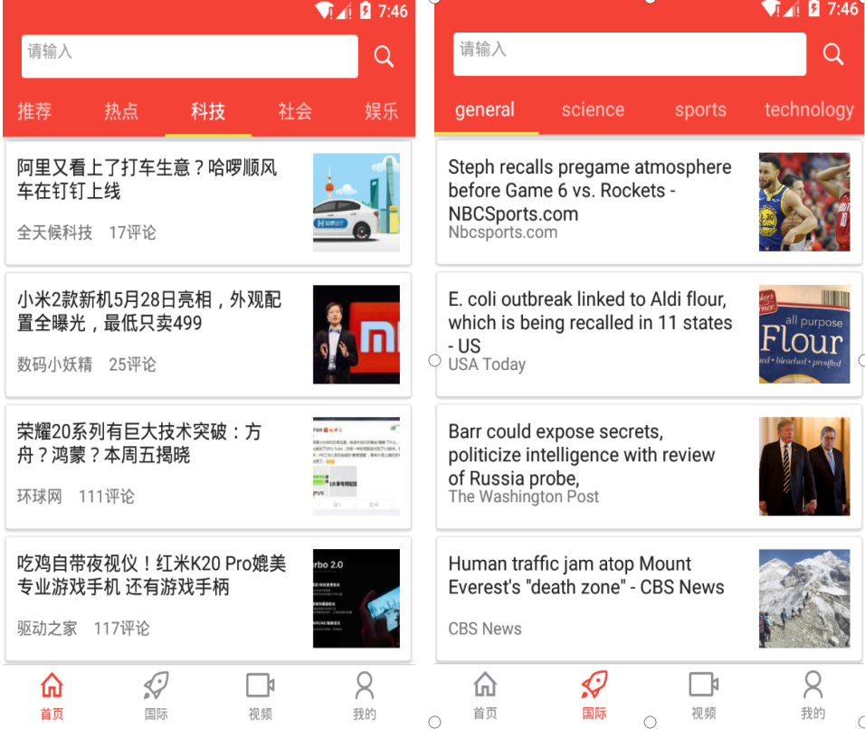
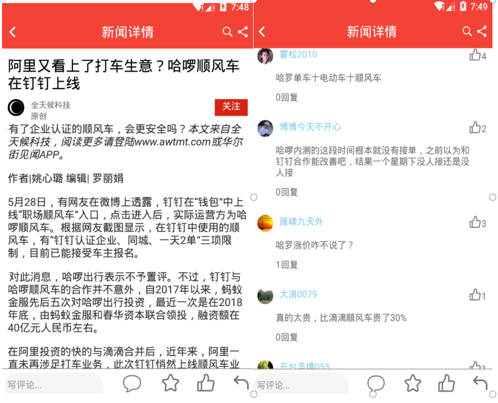
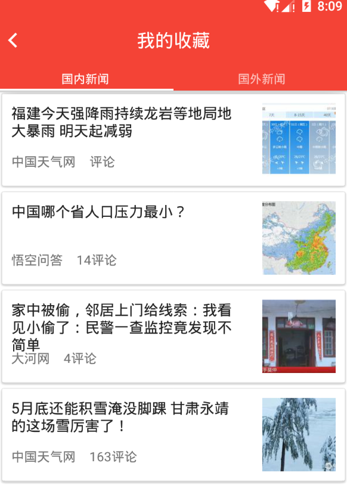
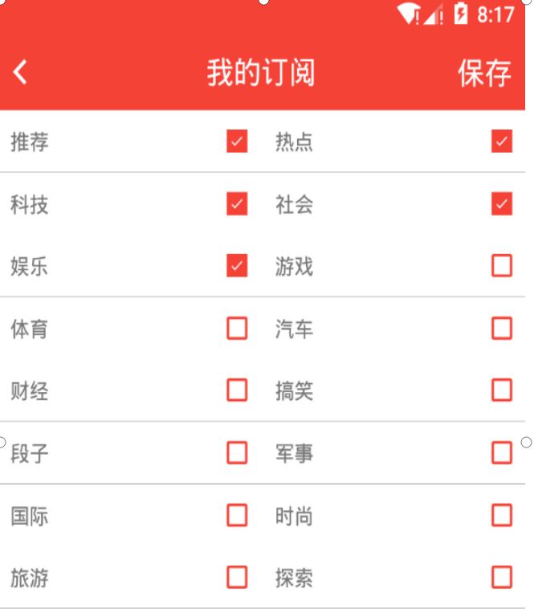
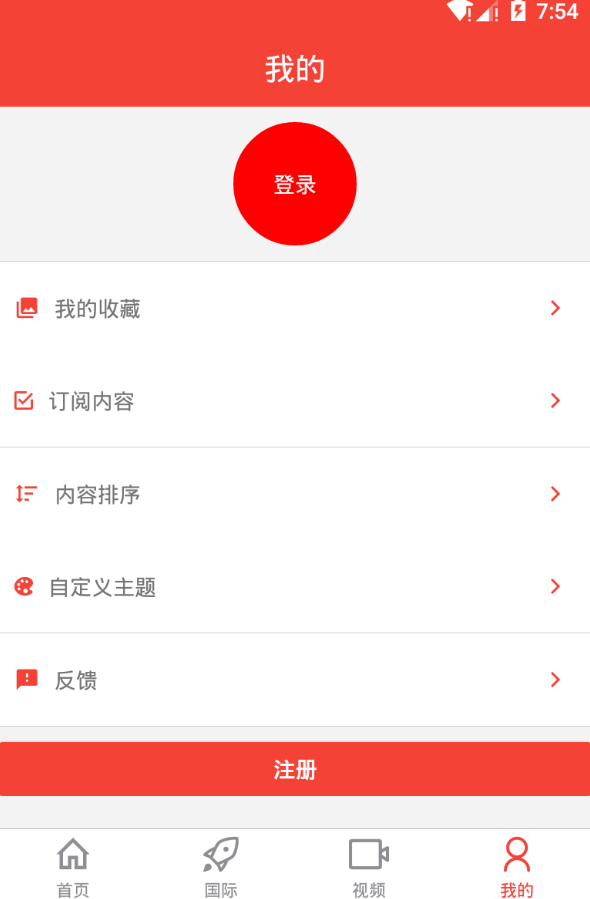

## React Native 新闻客户端

毕业设计的作品，目前还未完成。主要分为新闻客户端和PC管理系统。因设备问题，没有做IOS端的适配。数据主要从头条api，news api，后台会有入库操作。

### 技术栈

前端：

- React Native
- Redux

后台：

- nodejs
- express

数据库：
- MongoDB

### 已完成功能

- 登录注册
- 新闻列表
- 新闻详情
- 收藏功能
- 订阅功能
- 搜索
- 主题换肤

### 待完成功能

- 评论
- 分享
- 短视频
- 后台管理

### 部分效果图

新闻列表

新闻详情

搜索

收藏

订阅

个人中心

